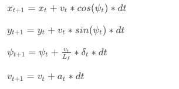

# CarND-Controls-MPC
Self-Driving Car Engineer Nanodegree Program

---

## Dependencies

* cmake >= 3.5
 * All OSes: [click here for installation instructions](https://cmake.org/install/)
* make >= 4.1(mac, linux), 3.81(Windows)
  * Linux: make is installed by default on most Linux distros
  * Mac: [install Xcode command line tools to get make](https://developer.apple.com/xcode/features/)
  * Windows: [Click here for installation instructions](http://gnuwin32.sourceforge.net/packages/make.htm)
* gcc/g++ >= 5.4
  * Linux: gcc / g++ is installed by default on most Linux distros
  * Mac: same deal as make - [install Xcode command line tools]((https://developer.apple.com/xcode/features/)
  * Windows: recommend using [MinGW](http://www.mingw.org/)
* [uWebSockets](https://github.com/uWebSockets/uWebSockets)
  * Run either `install-mac.sh` or `install-ubuntu.sh`.
  * If you install from source, checkout to commit `e94b6e1`, i.e.
    ```
    git clone https://github.com/uWebSockets/uWebSockets
    cd uWebSockets
    git checkout e94b6e1
    ```
    Some function signatures have changed in v0.14.x. See [this PR](https://github.com/udacity/CarND-MPC-Project/pull/3) for more details.

* **Ipopt and CppAD:** Please refer to [this document](https://github.com/udacity/CarND-MPC-Project/blob/master/install_Ipopt_CppAD.md) for installation instructions.
* [Eigen](http://eigen.tuxfamily.org/index.php?title=Main_Page). This is already part of the repo so you shouldn't have to worry about it.
* Simulator. You can download these from the [releases tab](https://github.com/udacity/self-driving-car-sim/releases).
* Not a dependency but read the [DATA.md](./DATA.md) for a description of the data sent back from the simulator.


## Basic Build Instructions

1. Clone this repo.
2. Make a build directory: `mkdir build && cd build`
3. Compile: `cmake .. && make`
4. Run it: `./mpc`.

## Basic Build with Docker on OS X

1. Clone this repo
2. run `chmod +x build_image.sh start_docker.sh`
3.  run `./build_image.sh`
4. run `./start_docker.sh`
5. Make a build directory: `mkdir build && cd build`
6. Compile: `cmake .. && make`
7. Run it: `./mpc`.

## Goal

The goal of this project is to implement Model Predictive Control to drive the car in the simulator around the track.


## The Model

For this project I have used a Kinematic Model. Kinematic Models are simplifications of dynamic models that ignore information such as tire forces, gravity and mass.
This will reduce the accuracy but will make the project more tractable.
It is important to notice also that we are not given information about tire forces and mass for this project.

The model needs to capture how the state of the vehicle evolves over time and how to operate on the actuators in order to change the state according to a desired trajectory (approximated by a third order polynomial).

#### The vehicle state

The state of the vehicle is defined by 4 variables: `[x, y, ψ, v]`

 * `x` and `y` define where the vehicle is located
 * `ψ,` defines the orientation of the vehicle
 * `v` defines the velocity
 
 The actuators with which we act on the state of the vehicle are
 
 #### Actuators and nonholomonic model
 
In a real vehicle the actuators are limited by the design of the vehicle and fundamental physics.
We can solve this by setting lower and upper bounds for the actuators.

* `a` which defines how much acceleration we want to apply to the vehicle. It could be forward or backward (braking), that is why it ranges between `-1` and `1`
 * `δ` is the steering angle and is constrained between `-25` and `25` degrees
 
 #### The Global Kinematic Model Equations
 
 
 
 #### Errors and a new vehicle state
 
 A controller activates the vehicle to follow the reference trajectory within a set of design requirements.
 One of the requirements is to minimize to errors:
 
 * The distance of the vehicle from the desired trajectory
 * The difference of the vehicle orientation and the trajectory orientation
 
 We can minimize these errors by predicting the vehicle's actual path and then adjusting the control inputs to minimize the differences between the predictions and the reference.
 
We can capture how these errors change over time by deriving a new kinematic model and a new state vector: `[x, y, ψ, v, cte, eψ]`

#### Cross Track Error and Orientation Error

The Cross Track Error - `CTE` - is the distance of the car with respect to the center of the road (approximated by a first order polynomial).
We can capture how the `CTE` changes over time with the following equation:

