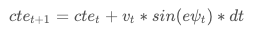
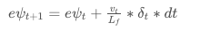

# CarND-Controls-MPC
Self-Driving Car Engineer Nanodegree Program

---

## Dependencies

* cmake >= 3.5
 * All OSes: [click here for installation instructions](https://cmake.org/install/)
* make >= 4.1(mac, linux), 3.81(Windows)
  * Linux: make is installed by default on most Linux distros
  * Mac: [install Xcode command line tools to get make](https://developer.apple.com/xcode/features/)
  * Windows: [Click here for installation instructions](http://gnuwin32.sourceforge.net/packages/make.htm)
* gcc/g++ >= 5.4
  * Linux: gcc / g++ is installed by default on most Linux distros
  * Mac: same deal as make - [install Xcode command line tools]((https://developer.apple.com/xcode/features/)
  * Windows: recommend using [MinGW](http://www.mingw.org/)
* [uWebSockets](https://github.com/uWebSockets/uWebSockets)
  * Run either `install-mac.sh` or `install-ubuntu.sh`.
  * If you install from source, checkout to commit `e94b6e1`, i.e.
    ```
    git clone https://github.com/uWebSockets/uWebSockets
    cd uWebSockets
    git checkout e94b6e1
    ```
    Some function signatures have changed in v0.14.x. See [this PR](https://github.com/udacity/CarND-MPC-Project/pull/3) for more details.

* **Ipopt and CppAD:** Please refer to [this document](https://github.com/udacity/CarND-MPC-Project/blob/master/install_Ipopt_CppAD.md) for installation instructions.
* [Eigen](http://eigen.tuxfamily.org/index.php?title=Main_Page). This is already part of the repo so you shouldn't have to worry about it.
* Simulator. You can download these from the [releases tab](https://github.com/udacity/self-driving-car-sim/releases).
* Not a dependency but read the [DATA.md](./DATA.md) for a description of the data sent back from the simulator.


## Basic Build Instructions

1. Clone this repo.
2. Make a build directory: `mkdir build && cd build`
3. Compile: `cmake .. && make`
4. Run it: `./mpc`.

## Basic Build with Docker on OS X

1. Clone this repo
2. run `chmod +x build_image.sh start_docker.sh`
3.  run `./build_image.sh`
4. run `./start_docker.sh`
5. Make a build directory: `mkdir build && cd build`
6. Compile: `cmake .. && make`
7. Run it: `./mpc`.

## Goal

The goal of this project is to implement Model Predictive Control to drive the car in the simulator around the track.


## The Model

For this project I have used a Kinematic Model. Kinematic Models are simplifications of dynamic models that ignore information such as tire forces, gravity and mass.
This will reduce the accuracy but will make the project more tractable.
It is important to notice also that we are not given information about tire forces and mass for this project.

The model needs to capture how the state of the vehicle evolves over time and how to operate on the actuators in order to change the state according to a desired trajectory (approximated by a third order polynomial).

#### The vehicle state

The state of the vehicle is defined by 4 variables: `[x, y, ψ, v]`

 * `x` and `y` define where the vehicle is located
 * `ψ,` defines the orientation of the vehicle
 * `v` defines the velocity
 
 The actuators with which we act on the state of the vehicle are acceleration and steering angle.
 
 #### Actuators and nonholomonic model
 
In a real vehicle the actuators are limited by the design of the vehicle and fundamental physics.
We can solve this by setting lower and upper bounds for the actuators.

* `a` which defines how much acceleration we want to apply to the vehicle. It could be forward or backward (braking), that is why it ranges between `-1` and `1`
 * `δ` is the steering angle and is constrained between `-25` and `25` degrees
 
 #### The Global Kinematic Model Equations
 
 
 
 _Lf_ is a multiplicative factor that takes into account the distance from the front of the vehicle and its center of the gravity.
 In other words: the larget the vehicle the slower it can turn
 
 #### Errors and a new vehicle state
 
 A controller activates the vehicle to follow the reference trajectory within a set of design requirements.
 One of the requirements is to minimize 2 errors:
 
 * The distance of the vehicle from the desired trajectory
 * The difference of the vehicle orientation and the trajectory orientation
 
 We can minimize these errors by predicting the vehicle's actual path and then adjusting the control inputs to minimize the differences between the predictions and the reference.
 
We can capture how these errors change over time by deriving a new kinematic model and a new state vector: `[x, y, ψ, v, cte, eψ]`

#### Cross Track Error and Orientation Error

**The Cross Track Error** - `CTE` - is the distance of the car from the center of the road (approximated by a first order polynomial).
We can capture how the `CTE` changes over time with the following equation:

 
 
**The orientation error** is calculated as the difference between the actual orientation and the tangential angle of the trajectory evaluated at `x<sub>t</sub>`

The update rule is practically the same as for `ψ`

 
 
 
## Timestep Length and Elapsed Duration (N & dt)
 
The first parameters that have to be chosen were `N` and `dt`.

See `src/MPC.h` where these parameters are set.

`N` defines the number of steps in the _prediction horizon_ and `dt` is how much time elapses between actuations.
The prediction horizon - _T_ - is the duration over which future predictions are made.

#### The horizon - `T`

The horizon should be of a few seconds, not more, because beyond that the environment changes to much.

In order to choose the right length I had to take into consideration that the longer the horizon the more computational expensive the control process become.
This is clear if we look at the equation that defines `T`: `T = N * dt`. 
Therefore the longer the horizon, given a define `dt`, the more the number of steps increases, meaning that we will have more actuations to compute

It was possible to drive aroung the track with an horizon of 1 seconds, but - because it's better to be safe than sorry on the road - I increased it to 1.5 seconds.

#### The number of time steps - `N`

The goal of the MPC is to optimize the control inputs `[δ, a]` over time.
For this reason the output of the optimizer is a vector of length `N*2`: [δ<sub>1</sub>, a<sub>1</sub>, ..., δ<sub>N-1</sub>, a<sub>N-1</sub>]

#### The timestep duration - `dt`

MPC attempts to approximate a continuous function - the reference trajectory - by means of discrete baths between activations.
The first logical value to try was `100 milliseconds` which is equal to the latency of the simulation.
It all worked out, therefore no other values were tried.


## Polynomial Fitting and MPC Preprocessing

Typically the path planning system passes the reference trajectory to the control system - `MPC` in our case - as a polynomial.
The trajectory is given by the simulator as a set of waypoints from which we need to infer a trajectory described by a third order polynomial

#### Preprocessing the waypoints

Because the waypoints are given in map coordinate system, it was necessary to transform them to vehicle coordinate system.

First I subtracted the all the points from the current position. This means that both the `x` and `y` coordinate will be at `0`. Second I wanted to make `ψ` zero as well, and in order to do that I rotated all of the points.

The math used for doing this is described by the following code.
    
``` C++
for(int i = 0; i < num_waypoints; i++) 
{
   const double dx = ptsx[i] - px;
   const double dy = ptsy[i] - py;
   x_veh.push_back(dx * cos(-psi) - dy * sin(-psi));
   y_veh.push_back(dy * cos(-psi) + dx * sin(-psi));
}
```

See line `106` to `117` in `src/main.cpp`


#### Fitting a third order polynomial

The function used to fit a `n` order polynomial from a set of `x` and `y` coordinates is adatped from thi [here](https://github.com/JuliaMath/Polynomials.jl/blob/master/src/Polynomials.jl#L676-L716)

The function is implemented in `src/main.cpp` from line `47` to line `66`

The third order polynomial was calculated using the above function and then used to calculate the coefficients, the Cross Track Error and the Orientation Error:

``` C++
auto coeffs = polyfit(x_veh_eig, y_veh_eig, 3);
double cte = polyeval(coeffs, 0);  
double epsi = -atan(coeffs[1]);
```

Lastly, we call the MPC with the current state and the coefficient of the trajectory that we just calcualated:

``` C++
vector<double> mpc_output = mpc.Solve(state, coeffs);
```

## Model Predictive Control with Latency

In order to account for a latency of 100 milliseconds I decided to keep the timestep duration equal to the latency.
Because the updates of the vehicle's state - _see kinematic model equations_ depend only on the previous timestep I decided to:
* keep the timestep duration - `dt` see sections above - equal to the latency.
* apply the actuations one extra step later. See `src/main.cpp` lines `120` to `124`

## Tuning the weights in the cost function

Quite some time was dedicated to tune the weights in the cost function.
All the weights are defined in `src/MPC.cpp` from line `36` to line `42`.

A few of comments:

* I set a very high cost for applying a high value of `δ` - steering -. This seemed to avoid sudden turns in the vehicle and a caotic way of driving.
* Because it is better to be safe than sorry when driving - will never say this enough - I decided to make sure that the car would slow down during curves.
As suggested here: https://discussions.udacity.com/t/mpc-cost-paramter-tuning-question/354670/6 as velocity increase, there is lot of change in `δ`. 
Adding this additional term in the cost helped a lot:

``` C++
fg[0] += 1500*CppAD::pow(vars[delta_start + t] * vars[v_start+t], 2);
```

## Video Demo

[](https://youtu.be/_5p5SAEyYYo)
